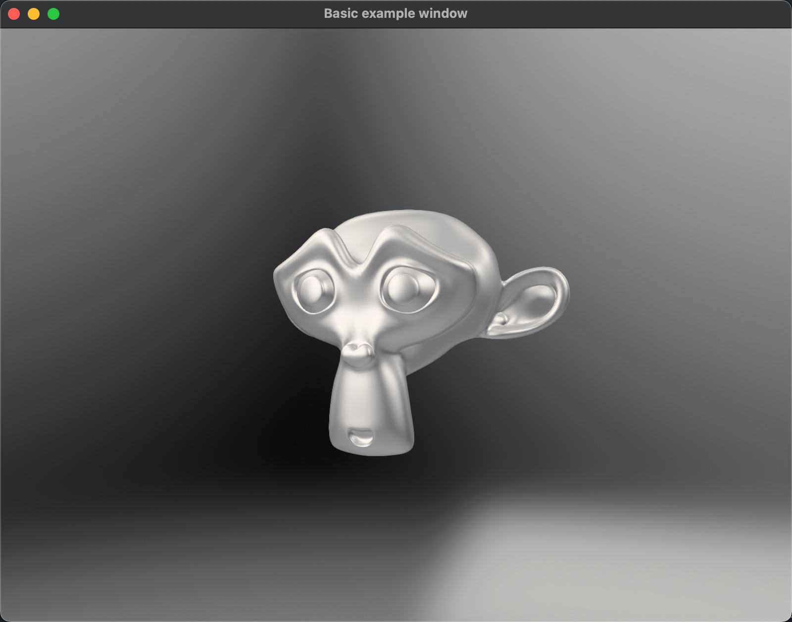

# filament-bindings

This package provides a set of unsafe binding api, build scripts and prebuilt binaries for [Google/filament](https://github.com/google/filament) on Windows, macOS, Linux.

# Why unsafe

All api's of this package are marked as unsafe, because the c++ objects of `filament` do not use reference counting to track resource usage, this library has no way of knowing when to release objects, you have to release resources manually.

# Prebuilt Binaries

Because filament builds are very slow and have build environment requirements. We provide prebuilt binaries for common platforms and features.

When a new version is released, github action automatically runs pre-build tasks, and all prebuilt binaries are saved in [filament-binaries/releases](https://github.com/EYHN/filament-binaries/releases).

The `filament-binding` build script will try to download the prebuilt binaries from github first, and skip the full source build.

We currently provide pre-built binary packages for `Windows`, `Linux`, `macOS`, and enable `OpenGL`, `Vulkan` backend for all platforms and `Metal` backend for macOS. For other platforms such as `Android`, `iOS` and `WASM` support is planned but not yet available.

# Build requirement

* cmake
* clang
* ninja
* libglu1-mesa-dev
* libxi-dev
* libc++-dev
* libc++abi-dev

# Examples

## triangle

Render a triangle and save the image to a ppm file

## winit

Use filament with `winit`.

run `cargo run --example winit`

